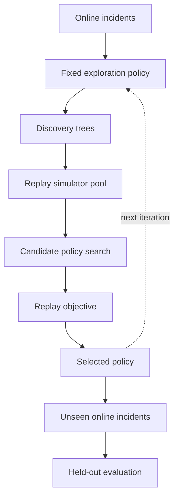

# DreamNet

[](https://github.com/eduardd76/DreamNet/actions/workflows/ci.yml)
[](LICENSE)
[](#project-status)

DreamNet is a clean-room, runnable reproduction of the core idea in
[Dream-RSI](https://arxiv.org/abs/2609.14858), applied to BGP and OSPF troubleshooting.
It learns **how to investigate** from recorded discovery trees while keeping the incident
generator, tool behavior, evaluator, and underlying troubleshooting logic fixed.

> The upstream Dream-RSI repository did not contain the announced code or reproduction scripts
> when this project was created. DreamNet is independent and is not an official Google/DeepMind
> implementation.

## Project status

**Experimental research prototype.** DreamNet is suitable for simulation, replay research, and
controlled lab testing. It is not a production network controller, does not include write-capable
device actions, and must not be treated as an autonomous remediation system.

Community contributions are welcome, especially:

- independently reproduced experiments and challenging held-out benchmarks;
- BGP, OSPF, EVPN, VXLAN, firewall, DNS, and Linux incident scenarios;
- read-only vendor and MCP adapters;
- parsers, deterministic network invariants, and evidence evaluators;
- Containerlab/EVE-NG lab fixtures and regression tests;
- analysis of replay bias, distribution shift, and failure modes.

Start with [CONTRIBUTING.md](CONTRIBUTING.md), read the [governance](GOVERNANCE.md), and report
security issues through [SECURITY.md](SECURITY.md), not a public issue.

## What works now

- Generates reproducible BGP/OSPF incidents across 14 fault classes.
- Runs an online fixed-policy exploration and records full discovery trees.
- Replays alternative policies without re-running tools or inventing outcomes.
- Searches executable orchestration-policy parameters with an evolutionary optimizer.
- Selects a policy only when it is no worse than the incumbent on the replay objective.
- Deploys the learned policy against unseen online incidents.
- Reports accuracy, diagnostic quality, tool calls, rounds, parallelism, and objective value.
- Provides read-only adapters for recorded fixtures and FRR nodes in Containerlab.
- Includes tests, linting, CI, JSON artifacts, and a human-readable evaluation report.

It intentionally does **not** make production changes. The FRR adapter allow-lists read-only
commands, and the simulation has no production action interface.

## Quick start

Python 3.11+ is required.

```bash
make install
make test
make demo
```

Or without Make:

```bash
python -m venv .venv
.venv/bin/pip install -e '.[dev]'
.venv/bin/dreamnet demo \
  --output artifacts/demo \
  --train 84 \
  --test 42 \
  --candidates 800 \
  --seed 7
```

Open `artifacts/demo/report.md` after the run. The default seeded experiment currently preserves
100% diagnostic accuracy on 42 held-out incidents and reduces mean tool calls from 18.0 to 5.88.
That is a simulator result, not a production-performance claim.

## The complete loop



Each online or replay decision uses the same interface. Given the root and currently visible leaves,
the policy returns up to `W` nodes to expand. Online expansion executes the frozen environment and
creates a child. Replay expansion reveals the next recorded child, never a counterfactual outcome.

## Objective

DreamNet implements the paper's quality/cost/parallelism structure:

```text
V = best_diagnostic_quality
    - beta_cost * tool_calls
    + beta_parallel * (tool_calls / decision_rounds)
```

Tune it from the CLI:

```bash
# Favor fewer tool calls
.venv/bin/dreamnet demo --beta-cost 0.04 --beta-parallel 0.005

# Favor parallel work more strongly
.venv/bin/dreamnet demo --beta-cost 0.01 --beta-parallel 0.20
```

The quality score in this example is a frozen deterministic evaluator backed by known incident
ground truth. A real vExpertAI deployment must replace it with evidence: digital-twin tests,
network invariants, intent validation, and expert-labelled outcomes. Allowing an LLM to score its own
diagnosis would make the learning loop easy to game.

## Fault coverage

The synthetic environment covers:

| Protocol | Faults |
|---|---|
| BGP | interface down, TCP/179 blocked, ASN mismatch, authentication mismatch, route-map filtering, unreachable next hop, MTU mismatch |
| OSPF | area mismatch, authentication mismatch, passive interface, duplicate router ID, missing redistribution, network-type mismatch, multicast blocked |

Every incident has six possible investigation branches: transport, session, policy, routing, recent
changes, and platform. A branch contains up to three increasingly specific tool/evidence steps.

## Artifacts

A demo run writes:

```text
artifacts/demo/
├── learned_policy.json
├── leaderboard.json
├── metrics.json
├── report.md
├── sample_baseline_trace.json
├── sample_learned_trace.json
└── trees/
    └── train-*.json
```

Replay any saved tree against the selected policy:

```bash
.venv/bin/dreamnet replay \
  artifacts/demo/trees/train-000.json \
  artifacts/demo/learned_policy.json
```

## FRR and Containerlab integration

`ContainerlabFRRAdapter` executes only allow-listed read commands via `docker exec`. Its output must
be normalized into a DreamNet observation and scored by a separate deterministic evaluator before it
is appended to a discovery tree.

The production integration boundary is deliberately narrow:

```python
from dreamnet.adapters import ContainerlabFRRAdapter

adapter = ContainerlabFRRAdapter(lab_prefix="clab-dreamnet")
result = adapter.execute("show_bgp_summary", "r1")
print(result.stdout)
```

See [docs/production-extension.md](docs/production-extension.md) for the phased path from the current
simulator to FRR, MCP tools, and vExpertAI's deterministic Network Reasoning Engine.

## Scientific honesty and limitations

1. The policy sees the evaluator's node score, as in the paper. In production that score must come
   from a trustworthy evidence function, not incident ground truth.
2. Replay covers only recorded paths. It cannot predict unseen tool outcomes and is not a digital twin.
3. The synthetic holdout uses unseen incidents but the same fault distribution. Cross-topology,
   cross-vendor, and distribution-shift tests are still required.
4. The evolutionary search replaces the paper's LLM policy-development agent. This makes the example
   dependency-free and reproducible but explores a smaller policy space.
5. A lower tool-call count does not necessarily mean lower MTTR. Worker count, tool latency, rate
   limits, and device impact need separate optimization.

## Project structure

```text
src/dreamnet/
├── adapters.py       # recorded and read-only FRR tool adapters
├── catalog.py        # BGP/OSPF fault catalog
├── environment.py    # frozen synthetic discovery environment/evaluator
├── policy.py         # executable branching, batching, stopping policy
├── rollout.py        # online tree construction
├── replay.py         # deterministic historical replay and objective
├── optimizer.py      # replay-based policy improvement and selection
├── reporting.py      # metrics, traces, and Markdown report
├── demo.py           # end-to-end experiment
└── cli.py            # dreamnet command
```

## License and attribution

DreamNet is released under Apache-2.0. It is inspired by the methodology described in the Dream-RSI
paper, but contains no upstream source code. Cite the original paper when building on the method.

For academic use, citation metadata is available in [CITATION.cff](CITATION.cff).
