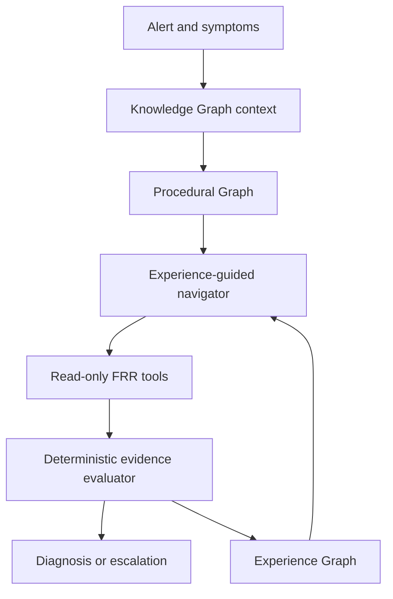

# DreamNet

[](https://github.com/eduardd76/DreamNet/actions/workflows/ci.yml)
[](LICENSE)
[](#project-status)

DreamNet is an **adaptive, evidence-driven troubleshooting procedure engine for network
operations**. It turns static troubleshooting playbooks into executable procedural graphs and uses
validated investigation experience to choose more efficient paths through them.

The project combines three deliberately separate graphs:

- **Knowledge Graph:** what exists and how it is related—devices, peers, interfaces and policies.
- **Procedural Graph:** what actions are allowed and what outcome leads to each next step.
- **Experience Graph:** what actually happened—executed step, context, evidence, outcome, cost,
  latency and validated diagnosis.

Its experience-guided navigation is inspired by the historical replay idea in
[Dream-RSI](https://arxiv.org/abs/2609.14858), but DreamNet is an independent network-operations
implementation.

> The upstream Dream-RSI repository did not contain the announced code or reproduction scripts
> when this project was created. DreamNet is independent and is not an official Google/DeepMind
> implementation.

## Project status

**Experimental research prototype.** DreamNet is suitable for simulation, replay research, and
controlled lab testing. It is not a production network controller, does not include write-capable
device actions, and must not be treated as an autonomous remediation system.

Community contributions are welcome, especially:

- independently reproduced experiments and challenging held-out benchmarks;
- BGP, OSPF, EVPN, VXLAN, firewall, DNS, and Linux incident scenarios;
- read-only vendor and MCP adapters;
- parsers, deterministic network invariants, and evidence evaluators;
- Containerlab/EVE-NG lab fixtures and regression tests;
- analysis of replay bias, distribution shift, and failure modes.

Start with [CONTRIBUTING.md](CONTRIBUTING.md), read the [governance](GOVERNANCE.md), and report
security issues through [SECURITY.md](SECURITY.md), not a public issue.

## What works now

- An executable BGP procedure covers session-down and established-but-route-missing paths.
- Deterministic evidence evaluators interpret FRR JSON/text rather than asking an LLM to self-score.
- A minimal Knowledge Graph models three routers, peer sessions, interfaces and export policy.
- An Experience Graph records each action and links incident, step, device, evidence and diagnosis.
- Raw tool output is represented by a SHA-256 digest; normalized evidence is stored for audit.
- Experience-guided navigation learns whether firewall or peer-configuration inspection has
  historically provided more diagnostic value in the current context.
- A three-router FRR/Containerlab topology includes controlled interface-down, ASN-mismatch,
  neighbor-shutdown and route-map-filter scenarios.
- The same engine runs against deterministic fixtures or a live local Containerlab.
- The original synthetic Dream-RSI-style replay experiment remains available for research.

It intentionally does **not** make production changes. The FRR adapter allow-lists read-only
commands, and the simulation has no production action interface.

## Quick start

Python 3.11+ is required.

```bash
make install
make test
make bgp-demo
```

Or without Make:

```bash
python -m venv .venv
.venv/bin/pip install -e '.[dev]'
.venv/bin/dreamnet bgp-demo \
  --fixtures examples/fixtures \
  --output artifacts/bgp-demo
```

The bundled four-scenario fixture run produces 100% deterministic diagnostic accuracy and reduces
mean tool calls from 3.75 to 3.25 after loading baseline experience. This only validates the engine;
the fixtures are not a production benchmark and were not captured live by this repository's CI.

## The complete loop



The Procedural Graph is the approved action space. DreamNet may change which eligible diagnostic
step is tried first, but it cannot invent an unapproved command or transition. When evidence is
insufficient, the graph ends in escalation rather than manufacturing a diagnosis.

## What is an Experience Graph?

It is a property graph of executed investigations, not a collection of prose memories. For example:

```text
Incident-147 --HAS_EXECUTION--> Execution-4
Execution-4 --USED_STEP-------> Compare-peer-configuration
Execution-4 --TARGETED--------> r1
Execution-4 --PRODUCED--------> Evidence-4
Evidence-4  --SUPPORTS--------> ASN-mismatch
```

The execution vertex carries context, tool, latency, cost and whether the step resolved the incident.
DreamNet aggregates these validated histories to rank eligible next steps. The Knowledge Graph says
that `r1` should peer with `r2` using AS 65002; the Experience Graph says that checking peer
configuration has historically been more useful than checking the firewall under similar evidence.

## Legacy replay experiment

The original `dreamnet demo` command implements the paper's quality/cost/parallelism structure:

```text
V = best_diagnostic_quality
    - beta_cost * tool_calls
    + beta_parallel * (tool_calls / decision_rounds)
```

Tune it from the CLI:

```bash
# Favor fewer tool calls
.venv/bin/dreamnet demo --beta-cost 0.04 --beta-parallel 0.005

# Favor parallel work more strongly
.venv/bin/dreamnet demo --beta-cost 0.01 --beta-parallel 0.20
```

The quality score in this example is a frozen deterministic evaluator backed by known incident
ground truth. A real vExpertAI deployment must replace it with evidence: digital-twin tests,
network invariants, intent validation, and expert-labelled outcomes. Allowing an LLM to score its own
diagnosis would make the learning loop easy to game.

## Fault coverage

The executable BGP procedure currently covers:

| State | Validated outcomes |
|---|---|
| Session not established | interface down, peer unreachable, TCP/179 blocked, ASN mismatch, neighbor shutdown, escalation |
| Session established but prefix missing | outbound route-map filter, escalation |

The separate legacy synthetic environment covers:

| Protocol | Faults |
|---|---|
| BGP | interface down, TCP/179 blocked, ASN mismatch, authentication mismatch, route-map filtering, unreachable next hop, MTU mismatch |
| OSPF | area mismatch, authentication mismatch, passive interface, duplicate router ID, missing redistribution, network-type mismatch, multicast blocked |

Every incident has six possible investigation branches: transport, session, policy, routing, recent
changes, and platform. A branch contains up to three increasingly specific tool/evidence steps.

## Artifacts

A BGP procedure run writes:

```text
artifacts/bgp-demo/
├── summary.json
├── knowledge_graph.json
├── procedural_graph.json
└── experience_graph.json
```

## FRR and Containerlab integration

`ContainerlabFRRAdapter` executes only allow-listed read commands via `docker exec`. The deterministic
BGP evaluator normalizes the returned evidence before the action is written to the Experience Graph.

The production integration boundary is deliberately narrow:

```python
from dreamnet.adapters import ContainerlabFRRAdapter

adapter = ContainerlabFRRAdapter(lab_prefix="clab-dreamnet-bgp")
result = adapter.execute("show_bgp_summary", "r1")
print(result.stdout)
```

See [lab/bgp/README.md](lab/bgp/README.md) to deploy the FRR topology, inject a controlled fault and
run `dreamnet bgp-run --live`. Live execution requires Docker and Containerlab; it is not exercised by
the unprivileged unit-test environment. The staged expansion plan is in
[docs/roadmap.md](docs/roadmap.md).

## Scientific honesty and limitations

1. The bundled fixtures mirror expected FRR output but are not evidence that the live lab succeeds on
   every host, image or Containerlab release.
2. Four fault scenarios are far too small to establish generalization.
3. The export-policy evaluator proves that a deny route-map is attached; future versions must prove
   that the specific prefix matches the complete policy chain.
4. Experience ranking can amplify biased incident history. Promotion requires held-out topologies,
   fault families and time periods.
5. Lower tool-call count does not necessarily mean lower MTTR or lower device impact.
6. DreamNet is read-only. Remediation belongs behind a separate validation and approval boundary.

## Project structure

```text
src/dreamnet/
├── adapters.py       # recorded and read-only FRR tool adapters
├── graphs.py         # knowledge, procedural and experience graph primitives
├── bgp_procedure.py  # executable BGP graph, evaluator and navigator
├── bgp_demo.py       # fixture suite and live Containerlab runner
├── catalog.py        # BGP/OSPF fault catalog
├── environment.py    # frozen synthetic discovery environment/evaluator
├── policy.py         # executable branching, batching, stopping policy
├── rollout.py        # online tree construction
├── replay.py         # deterministic historical replay and objective
├── optimizer.py      # replay-based policy improvement and selection
├── reporting.py      # metrics, traces, and Markdown report
├── demo.py           # end-to-end experiment
└── cli.py            # dreamnet command
```

## License and attribution

DreamNet is released under Apache-2.0. It is inspired by the methodology described in the Dream-RSI
paper, but contains no upstream source code. Cite the original paper when building on the method.

For academic use, citation metadata is available in [CITATION.cff](CITATION.cff).
